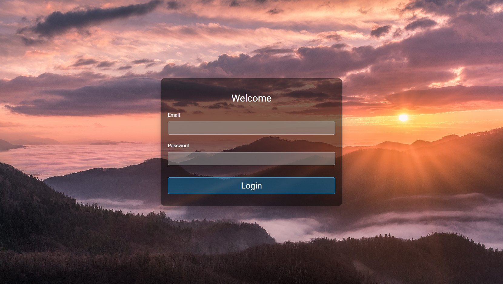

  

<h3 align="center">Transparent Login Form with Validation</h3>

---

 Transparent Login Form with Validation. The design was taken from Web Dev Simplified.
     

## 📝 Table of Contents

- [About](#about)
- [Built Using](#built_using)
- [Authors](#authors)
- [Acknowledgments](#acknowledgement)

## 🧐 About 

Simple one-page Bootstrap (with a sprinkle of SASS) project of a neat login page with a transparent background and validation built in. The design was taken from a recent video of Web Dev Simplified.

## 🚀 Deployment 

- [Live View](https://seesmof.github.io/transparent-login-form/)

## ⛏️ Built Using 

- [HTML](https://www.w3.org/html/) - Markup Language
- [CSS](https://www.w3schools.com/css/) - Styling Language
- [SASS](https://sass-lang.com/) - CSS Pre-Processor
- [Bootstrap](https://getbootstrap.com/) - CSS Framework

## ✍️ Authors 

- [@seesmof](https://github.com/seesmof) - Development
- [@WebDevSimplified](https://youtu.be/reumU4CvruA) - Idea & Desing

## 🎉 Acknowledgements 

- [@WebDevSimplified](https://youtu.be/reumU4CvruA) for great tutorials and videos overall
